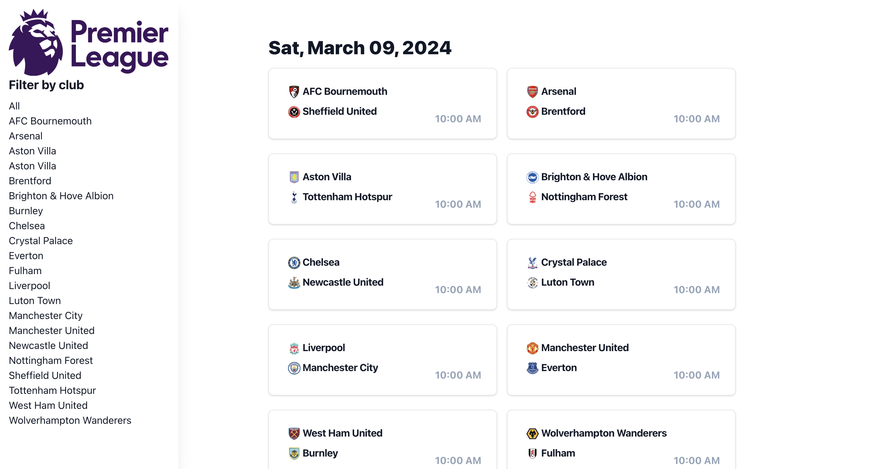
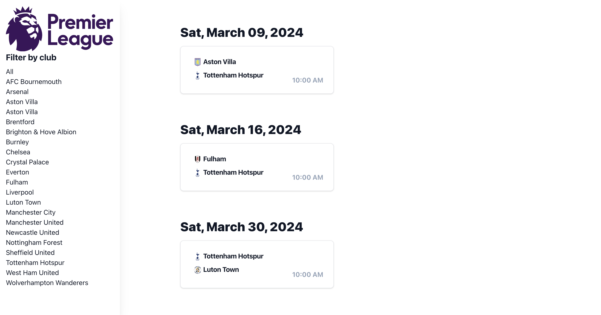
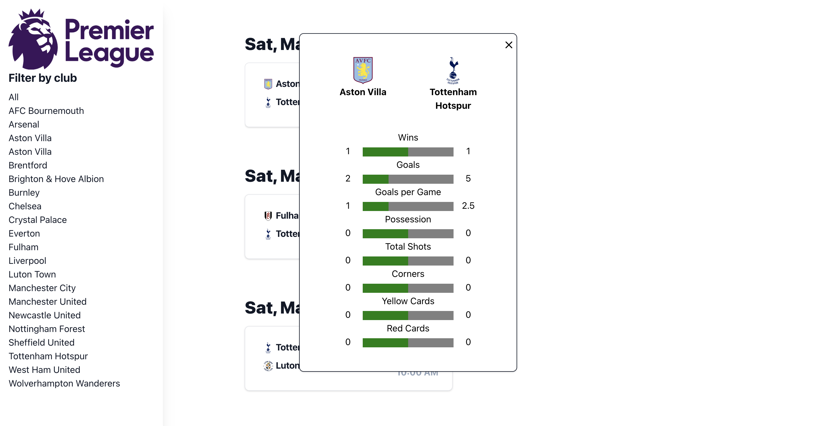

# Premier League Dashboard

An dashboard to keep track of upcoming Premier League soccer games. Built with React, TailwindCSS, PostgreSQL, and FastAPI.

## Setup

Virtual Environment:

1. `./setup.sh`
2. `source env/bin/activate`

Application:

1. Backend: `uvicorn backend.main:app --reload --port 8000`
2. Frontend: `npm run start`

## Images

Front page:

Filtered by Tottenham games:

Head-to-head statistics:

## TODO

1. Add important statistics
    - win probabaility
    - shots on goal
    - fouls
    - etc.
2. Filter by more than one team